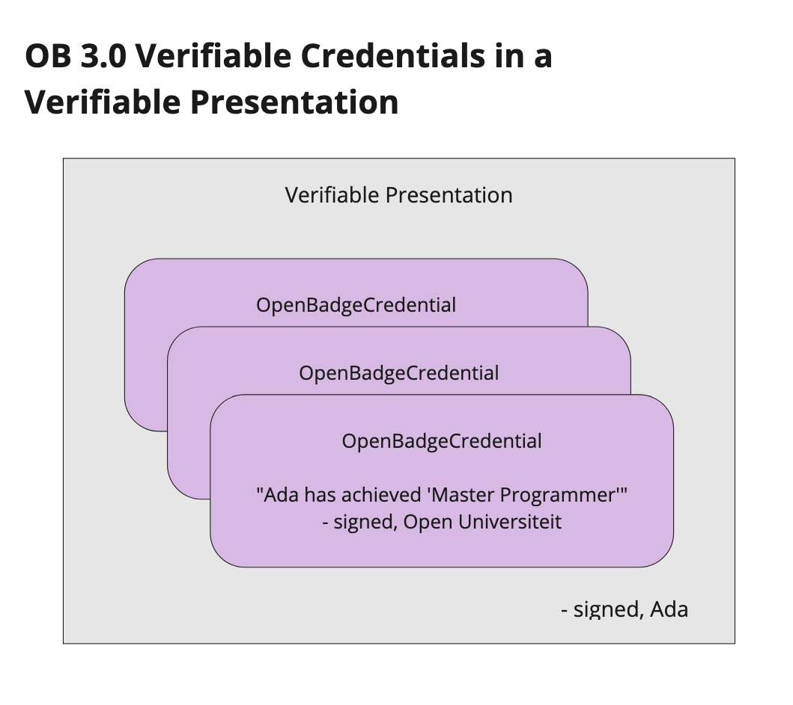

### 3.1: Open Badges 3.0 key features and considerations

The Open Badges schema enables issuers to make claims about achievements, typically in learning or skill development, whose criteria learners have met.

**Verifiable Credentials Data Model**: With the 3.0 version, Open Badges now implements W3C’s [Verifiable Credentials Data Model](https://www.w3.org/TR/vc-data-model/) (VC). Within this data model, a Verifiable Credential is a general purpose “envelope” for many possible claims that issuers may make about a range of credential subjects. Credential subjects are not only those people we often think of as learners who receive Open Badges, but also companies, shipments, and internet-of-things connected devices. The range of what claims may be made about these subjects is large, and the model assumes that communities of common usage patterns will arise. Open Badges now represents such a usage community, focused on use cases related to education and employment. An awarded Open Badge makes the VC claim, “This learner has achieved a specific achievement”, like “Ada has achieved ‘Master Programmer’”. Consistently using Open Badges to describe achievement definitions and issued credentials enables an ecosystem to develop where a critical mass can more easily gather around this layer of the digital credentials tech stack, resulting in actual interoperability and the opportunity to realize digital credentials for some form of value, such as new opportunities in employment.

Another model in scope of the VC spec is the [Verifiable Presentation](https://www.w3.org/TR/vc-data-model/#presentations), another envelope that allows someone to express information from the credentials they have received, in a way that allows the audience to verify not only that the claims are authentic expressions of their issuers, but also that the subject of those credentials is the person who is presenting it to them. In the case of badges, the learner signs an outer envelope that includes several issued badges that are themselves each signed by their issuer. An example of a Verifiable Presentation with badges is when an Open Badges recipient sends several of their Open Badges-compliant Verifiable Credentials to an employer, and they sign this message using the same technologies that each badge uses. This type of workflow typically requires learners to have a wallet app separate from Edubadges.

Three OpenBadgeCredentials are in a VerifiablePresentation. Each OpenBadgeCredential makes a claim like “Ada has achieved ‘Master Programmer’” and is signed by Open Universiteit. The Verifiable Presentation is signed by Ada.

**Cryptographic digital signatures**: While Open Badges could be cryptographically signed beginning in 2012 with version 1.0, this capability has not been widely used in the ecosystem. A vanishing fraction, less than 1% of all badge awards in production use the signed verification method instead of the vastly more popular hosted verification. Edubadges explored pilot capabilities to sign badges, but with OB3, these efforts will be refreshed and then moved into production.

**Use cases for shared achievement definition**: OB3 introduces an important change, as a side effect of adopting Verifiable Credentials. The applications in the VC ecosystem are not expected to have Open Badges-specific verification procedures. The verification layer that is common to all credentials is at the proof level of the credential itself. This means that OB3 no longer has a capability to ensure that _the issuer of the credential to a specific learner is the same entity that defined the Achievement that is being asserted_. This subtle difference actually has large consequences for the type of ecosystem that may develop under OB3. This means that:

*   Multiple different issuers may award the same defined Achievement, opening up cases for multiple issuers to recognize the same skill or competency achievements as one another. Previously, the closest issuers could come to this use case would be to each recognize their own Achievement (in 2.0 called “BadgeClass”) that _aligned to the same competency URL_ as one another.
*   Consumers/verifiers now need to determine on their own that when they expect a user to have a certain achievement that the credential they present that makes this claim is awarded by the expected issuer. Previously in 2.0, it was typically only necessary to check that the assertion was verified and that the achievement ID was the expected URL.
*   Consumers need to determine their trust in the issuer (see [notes on issuer identifiers](#issuer-identifiers) below for a discussion of issuer trust verification), but they also need to determine that the issuer of this specific credential should be trusted to recognize the Achievement it claims the subject has achieved. One university cannot be trusted to award the certificates that have been specifically defined by another university, for instance.

See an extended [discussion](#achievement-definitions-in-ob-3.0) of how consumers may process and understand advanced Achievement use cases in a later chapter.

**Improved opportunities for learner privacy and control**: There are a number of impacts of OB 3.0 on learners’ ability to control the privacy of their data. Specifically, cryptographically signed badges no longer necessitate a publicly hosted JSON file for verification, meaning that access to verifiable copies of the credential are no longer immediately available to anybody who has the URL. The potential to receive badges where learners are identified using Decentralized Identifiers (DIDs) potentially enables some further protection of learners against unwanted correlation, which may be valuable as people are increasingly becoming aware how they are tracked across the web by advertisers and other companies. Products that update to OB 3.0 have an opportunity to take advantage of these new features to reduce the exposure of learner data and increase learner control over how and when data is shared. These benefits are not automatic consequences of adopting OB 3.0; they require strategic selection of implementation options and the development of new features specifically to take advantage of these options.

---

| [Back to Index](ob3-edubadges/README.md)   | [Back to Chapter 3: The Open Badges and Digital Credentials Landscape](ob3-edubadges/30-the-open-badges-and-digital-credentials-landscape.md) |    [Next Chapter 3.2: 1EdTech specification process](ob3-edubadges/32-1edtech-specification-process.md) |
| :--- |  :---:  | ---: |
