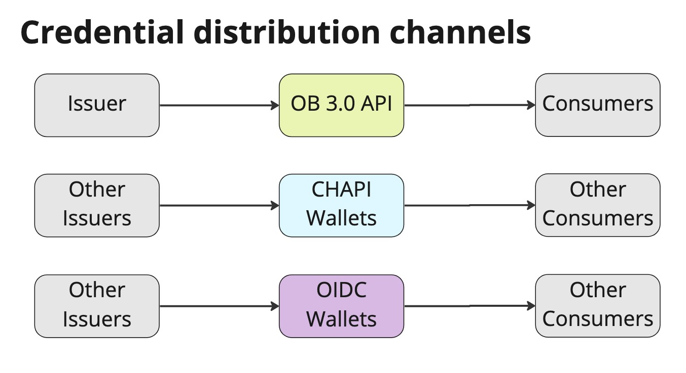

4: Strategic Alignment: the Big Picture
------------------------------------

How should Edubadges approach the digital credentials landscape, when it has so many shifting factors that affect investments? The answer is to maintain focus. Identify a limited number of scenarios in which new opportunities are opened for learners _because of the badges those learners hold and present_. Then ensure learners can bring their badges to these contexts. The goal is software that facilitates badge transfer to the destinations that are ready to receive them.

An example might be Edubadges connecting with a partner vendor that makes HR applicant tracking software. These two parties both arrange to integrate with the same wallet, and the result is that learners gain the ability to present their edubadges directly to employers who use the applicant tracking system.

Each set of tech stack choices potentially establishes a channel over which achievement credentials are communicated. There are many such possible combinations, and Edubadges cannot invest in integration with them all, in order to maintain focus and budget. The risk is that different channel choices reach different potential consumers. Building ecosystem momentum around transmission paths that are working is important. If a reinforcing cycle around a common pattern develops early, that will increase the chances of connection for a particular learner.

There is a risk of fragmentation of the ecosystem along every different layer of the tech stack where there are incompatible choices, such as wallet protocol

At the same time, it is important that no individual learner is left without an adequate channel through which to make use of their badges, just because the employer they want to work with or the school where they want to apply doesn’t use a particular protocol that is the one Edubadges has chosen to support.

SURF is responsible for discovering how next-generation credentials can bring new opportunities to learners who engage with SURF member institutions. Edubadges should accomplish this through its pilot-to-production mode of product development. The first phase of a pilot could be a minimal OB 3.0 implementation aimed at 1EdTech conformance certification, and follow up phases could be structured around channels where learners can share their credentials with target consumers. All the while, Edubadges should continue to offer established patterns like share-by-URL. Over time, if the next-generation protocol gains traction, that becomes the main focus of the application, with legacy approaches used as a fallback so that learners can continue sharing credentials with consumers not yet wired up to the next-generation ecosystem.

SURF often envisions the development of projects like Edubadges in terms of offering pilots and production services. The function of pilots within this structure is to explore next-generation technologies that may provide benefits to SURF member institutions. The function of production services is to provide reliable utilities of established value to those members. Promising pilots can evolve into production services, and pilots that don’t identify significant value come to an end to enable new exploration.

OB 3.0 and the eIDAS/European Digital Identity ecosystems diverge in technological approach, scope, and timeline. Edubadges will only have limited opportunities to invest in the development of pilots related to wallets in the next 2 years, so a pilot approach should be designed to most effectively gather information about the value of integration, and a production approach should be selected to most simply create the greatest opportunity for learners to use their Open Badges.

Here is a schedule of pilots and production service launch events that could result in an impactful next-generation digital credentials rollout over 3 years:

*   Architectural refinement and simplification
*   Pilot 1 (Q3-Q4 2023): Add new OB 3.0 issuer support, achieving 1EdTech’s Issuer certification role, but do not yet implement the optional API.
*   Pilot 2 (Q1-Q2 2024): Observe the Verifiable Credentials / Open Badges ecosystem, choose a wallet partner in this space, and implement a connection protocol and user workflow for this wallet.
*   Pilot 3 (Q3-Q4 2024): Observe the development of European digital identity wallets, and consider delivering an integration with a promising option here as an alternate delivery path for the same achievements.
*   Production: Complete refinements of the user experience, and launch successfully piloted features to all users, with focus on partners that consume edubadges.

The next chapter (Architecture Considerations) outlines some specific architectural challenges and identifies recommended paths forward in each area, as much as possible, including for architectural simplification and the addition of new secure cryptographic signing tech stack components. The following chapter (Use Cases in Detail) provides an in-depth technical guide to the data model level of the implementation of pilot 1. The appendix (User Stories and Milestones) describes the user’s experience of Pilot 1 and Pilot 2 features.
  
---

| [Back to Index](README.md)   |  [Previous Chapter 3: The Open Badges and Digital Credentials Landscape](30-the-open-badges-and-digital-credentials-landscape.md)     | [Next Chapter 5: Edubadges Architecture Considerations](50-edubadges-architecture-considerations.md) |
| :--- | :---: | ---: |