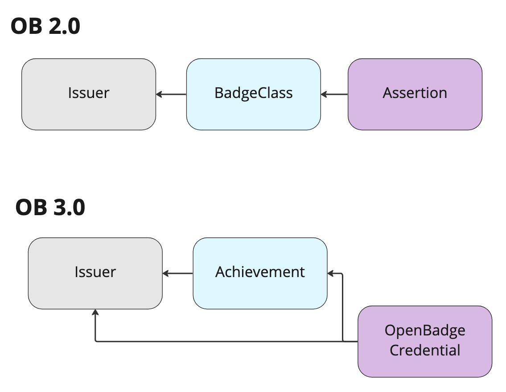
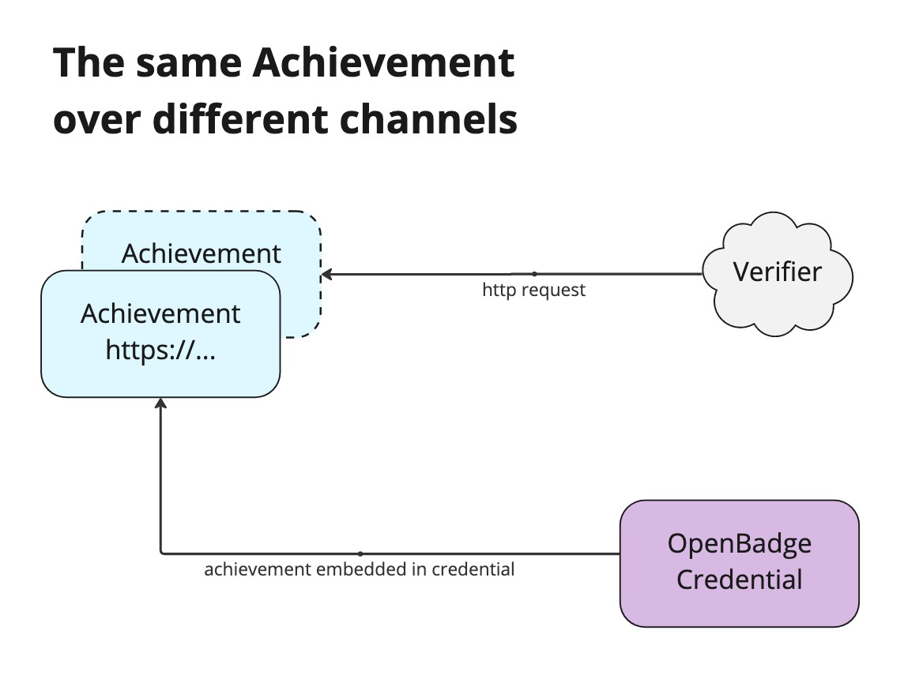
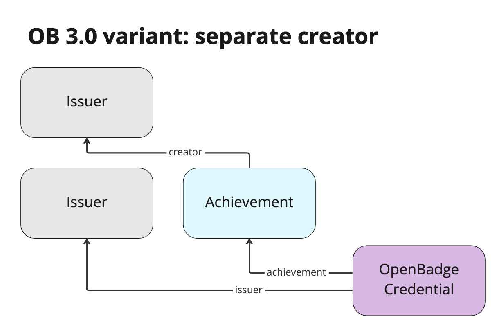
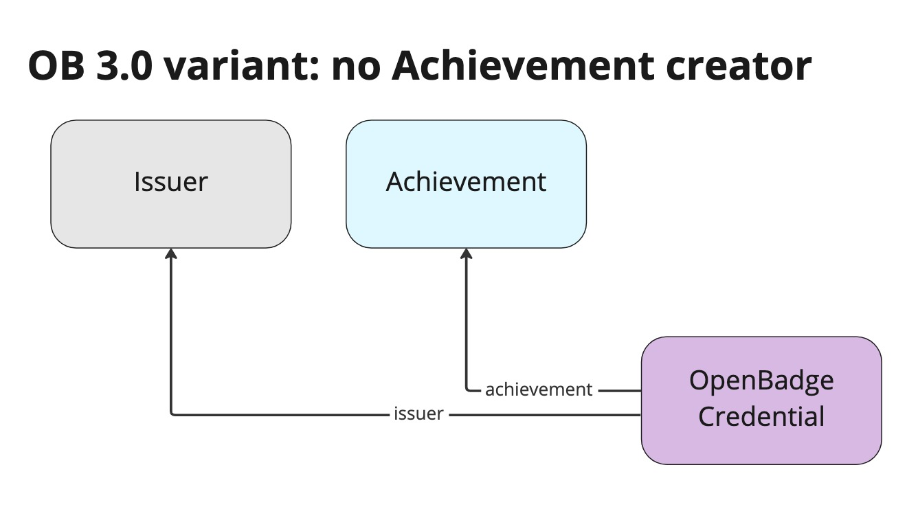

### 6.2: Achievement definitions in OB 3.0

OB 3.0 has some important changes for when Achievements are expressed and accessed, and how verifiers are expected to interpret them. The name changed, from `BadgeClass` to `Achievement`, at the simplest level. There is a wealth of new data properties available that issuers may use to richly express information about the Achievement and its requirements, including the ability to publish an entire rubric.

But the most consequential changes will be about how Achievements are expressed and understood. The Achievement is the core of an Open Badge. It’s what connects the credential to the world, the descriptor of the value it holds for the issuer.

If OB 3.0 is successful and results in widespread consumption, the ways these consumer systems negotiate the meaning of the Achievement will be consequential. A common usage pattern may emerge, enabling badge consumers to consistently describe the connection between an Achievement and its creator, and between an OpenBadgeCredential and its Achievement. OB 3.0 implementers will need to negotiate the meaning of an Achievement as it is included in a particular OpenBadgeCredential versus that same Achievement retrieved from an http URL that is its `id`. Establishing specific expectations may be covered by future OB specifications. The use cases Open Badges supports are suddenly wide open, but the consumer side of the ecosystem will be painfully slow to develop.

The VC data model that OB 3.0 adopts places the issuer link in the OpenBadgeCredential, not within the Achievement, where it appeared in OB 2.0. This changes the link between the objects in the graph.

*Figure 3: OB 2.0 has Assertion with an arrow to BadgeClass with an arrow to Issuer. OB 3.0 has OpenBadgeCredential with an arrow to Achievement and an Arrow to Issuer, and Achievement also has a creator arrow to issuer.*

It is not necessary to independently host a copy of the Achievement for OB 3.0, but it is strongly recommended. But even if you do, achievements are now embedded in portable signed OpenBadgeCredentials, and the data within the credential may vary from data expressed accessed at the HTTPS `id` of the Achievement.

The process of credential verification does often involve checking web resources related to the credential, but this is often performed for the sole purpose of ensuring that the proof is valid and the data has not been modified in transit. Issuer and public key information is gathered if needed, but these processes often stop before they try to make sense of the contents of the claims within `credentialSubject`. Open Badges can pass through verifiable credentials processing systems unharmed, but only software that is designed specifically to process the achievement claim made in an Open Badge will ever potentially check for JSON-LD data hosted at the `id` of an Achievement referenced from within an OpenBadgeCredential.

When an Achievement uses a HTTPS URL as an `id` where it may be fetched, and the data within an Achievement can be edited over time, consumers will have to puzzle out what this means to them. Which channel is trusted for what value over time?

*Figure 4: Verifier symbol with an http request arrow going to one copy of an Achievement, and a OpenBadgeCredential with an arrow going to another copy of the same Achievement.*

Because of the shift to cryptographic signing, verifiers are expected to interpret the copy that is embedded in the signed OpenBadgeCredential as the achievement value, as it was understood at the time the credential was issued. This is a subtle but consequential paradigm shift. It will simply take time actually encountering issues like these badges in production and working through interpreting meaning from those badges in order to know how the ecosystem will interpret different variants of badges.

It is now possible for an Achievement to identify a creator that is separate from the issuer of the OpenBadgeCredential in which the Achievement appears.

*Figure 5: An OpenBadgeCredential with an arrow to an Achievement and an arrow to an Issuer. The Achievement has an arrow labeled creator to a different Issuer.*

Many badges will not identify a creator of the Achievement, as it is embedded in the OpenBadgeCredential. In these cases, it should be assumed that the credential issuer is also the one responsible for the Achievement definition. In OB 3.0 there is no specific capability to determine that an issuer profile “Issuer A” that is claimed to be the creator of an Achievement in an OpenBadgeCredential signed by “Issuer B” actually authored or approved the data included. There is no data integrity checking at this level.

*Figure 6: An OpenBadgeCredential with an arrow to an Achievement and an arrow to an Issuer. There is no arrow from the Achievement to this issuer or any other as its creator.*

While the ecosystem puzzles out what to do with these new cases for Achievements, the OpenBadgeCredentials will continue to show green validity checkmarks at the Verifiable Credentials level whenever they are checked, no matter which of the above variations they exhibit. These previously would have been impossible or invalid.

One purpose for consuming Open Badges is for learners to be able to tell the story of their achievements to another person, like a hiring manager or admissions officer. At this level, where the badge’s main purpose is to be displayed to a human, the verification that the data presented is indeed signed by a trusted and expected issuer is all the consumer needs to work with the badge manually. Systems that take on the complex task of consuming badges through automated processes where consequential decisions for instant access or benefit are made will need to check a significant number of additional expectations about the Achievement. In order to truly take advantage of any of the variant use cases around OB 3.0 Achievements, the ecosystem needs to deliver products that have quick feedback cycles, where learners who hold certain achievements from certain issuers regularly get benefits. As Edubadges moves beyond OB 3.0 pilots to production services, some automated consumption should be happening with identified partners. This usage will inform SURF and the ecosystem more broadly about what next steps to take.