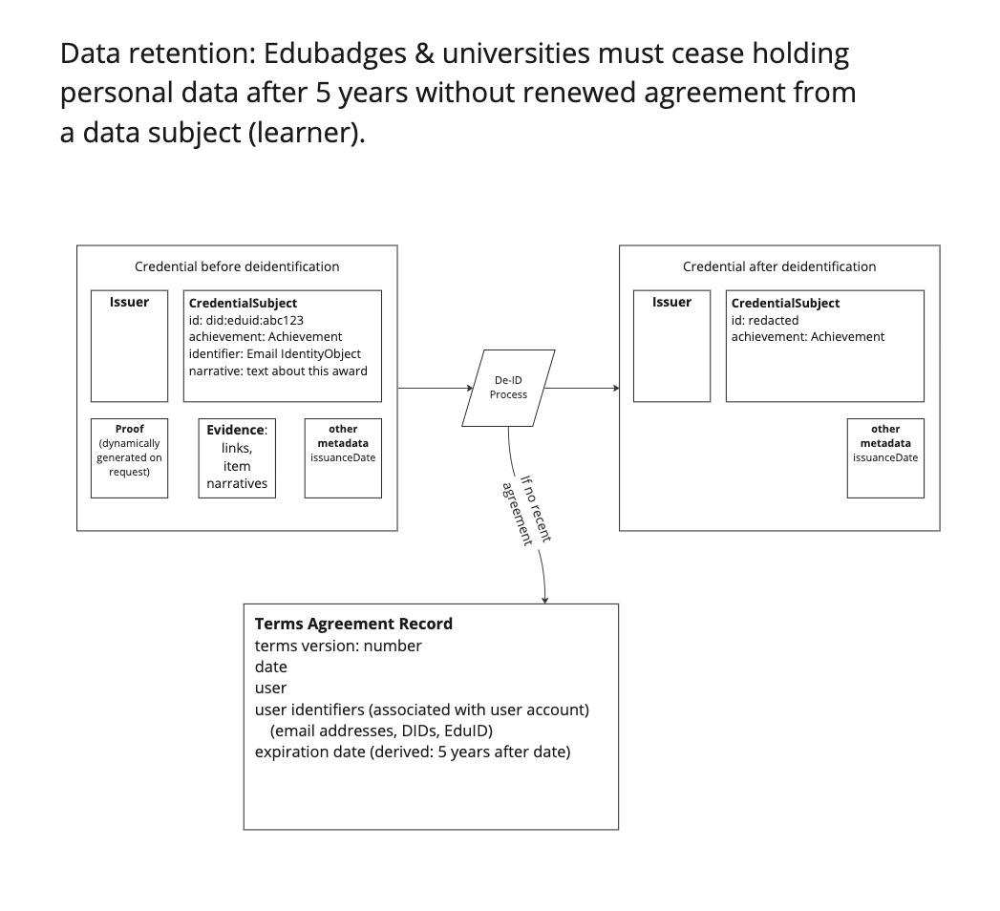

### 6.3: Data minimization and defensible deletion after retention period

A large challenge faced by SURF is the potential that the Edubadges system may need to comply with a requirement to expunge personal data after 5 years without renewal of a user agreement that enables processing.

This is possible to build, but it represents a large amount of development effort, so it should be placed into the roadmap with care. There are two main categories of workflow to explore.

1.  Workflows to obtain renewal of terms agreement to extend legal data custody.
2.  Workflows to identify and delete data as it approaches its retention deadline without compromising system integrity.

Edubadges could pursue one or both approaches, so it’s important to understand the benefits, drawbacks, and coverage of each strategy. The most salient consideration is whether it would be practical to obtain terms agreement renewal with some notification workflow at all, if it were top priority for Edubadges, and the project spared no expense to complete it. It would still not be possible to reach 100% coverage across thousands of students, some of whom might become uncontactable at all known email or physical addresses, and some of whom might unfortunately pass away. Therefore, for at least some portion of the records held within the Edubadges system, it would be necessary to implement some deletion protocol.

With OB3, credentials are delivered as portable JSON documents that include a digital signature created by a keypair associated with the issuer. Even if the issuer system deletes its records of the credential, a copy held by a learner or deposited into an external long-term storage vault remains valid. This means that learners exporting credentials to their own wallets or backpacks is one valid strategy. The Dutch government can also potentially hold records about students after SURF and its university partners no longer can access it, because the government is not subject to the same deletion rules. A workflow to transfer signed credentials that are expiring to the government could be implemented if the data would ever be useful to hold in such a long-term storage vault. There is no need to do it unless you can identify why it would be helpful, instead of just in the hands of the learners themselves. If a use case emerges later for this transfer, a workflow to accomplish that transfer could be built later, so addressing this possibility is not urgent, other than noting that the signed credential format is an adequate format in which to transfer this sort of data if/when desired.

What would a defensible deletion strategy for issued credentials entail? The simplest approach would be to fully delete records:

1.  Periodically trigger records cleanup task, such as monthly.
2.  When records cleanup task is run, identify users for whom data needs to be deleted, such as users within 1 month of 5 years after their latest terms agreement.
3.  For each identified user, delete relevant records: User (BadgeUser), Email Address (and associated case variants and confirmations), terms agreements, Backpack imported assertions, issued badge instances (and associated baked images in media storage)

Diagram showing deidentification of a badge award, where PII is stripped out and the recipient identifier is replaced with a randomly generated value

Note that the strategy this report recommends is dynamic generation of signed objects on demand. The diagram represents the data as a finished credential, but the system stores the data across rows in one or more tables in a relational database. Deletion of the data entails removing or obfuscating that data at its source which then affects the system’s ability to generate completed credentials. After minimization or deletion, the system would not likely continue to offer to package the incomplete data into a signed credential, and the user account for the user in question would be removed or disabled, so there would be no user to request the credential.